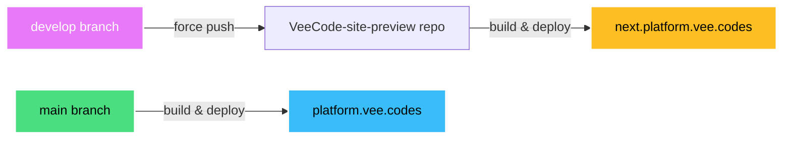

# CLAUDE.md - VeeCode Platform Site

## Project Overview

This is the **VeeCode Platform marketing website** - a Next.js-based site showcasing the VeeCode Internal Developer Platform (IDP) built on Backstage. It serves as a marketing hub with product information, plugin catalog, pricing, and multi-language support.

## Tech Stack

- **Framework:** Next.js 15.3.2 with App Router
- **React:** 19.0.0
- **TypeScript:** 5 (strict mode)
- **Styling:** Tailwind CSS 4.1.6 with custom theme
- **UI Components:** Radix UI + shadcn/ui architecture
- **i18n:** next-intl 4.1.0 (English & Portuguese)
- **Forms:** Formik, React Hook Form, Yup
- **Data Fetching:** TanStack Query, Axios
- **Analytics:** Google Tag Manager, Google Analytics

## Essential Commands

```bash
yarn dev          # Development server
yarn build        # Production build (static export)
yarn start        # Start Next.js server
yarn static       # Serve static output locally
yarn eslint:fix   # Auto-fix linting issues
```

## Agent Skills Setup

This project includes **Vercel Labs agent skills** - curated React and Next.js best practices from Vercel Engineering that AI coding assistants can reference when writing code.

### Installed Skills

- **vercel-react-best-practices** (57 optimization rules)
  - Eliminating async waterfalls with `Promise.all()`
  - Bundle size optimization (direct imports, dynamic imports)
  - Server-side performance (React.cache(), parallel fetching)
  - Re-render optimization (memoization, derived state)
  - Rendering performance (content visibility, static JSX)

- **vercel-composition-patterns** (React architecture)
  - Compound components over boolean props
  - React 19 patterns (no forwardRef needed)
  - State management best practices

- **web-design-guidelines** (Frontend design)
  - UI/UX best practices
  - Design system patterns

- **agent-browser** (Browser automation)
  - Automated testing and QA workflows
  - Form submission validation (contact forms, newsletter signup)
  - Screenshot capture for documentation
  - Web accessibility testing
  - Multi-locale navigation testing (en/pt)

### Setup After Clone

**Important:** After cloning this repository, run the following commands to generate AI assistant symlinks:

```bash
npx skills add vercel-labs/agent-skills --yes
npx skills add https://github.com/vercel-labs/agent-browser --skill agent-browser --yes
```

This creates symlinks in directories like `.cursor/`, `.claude/`, `.cline/` that allow AI coding assistants (Claude Code, Cursor, Copilot, etc.) to access the skills. These symlinks are gitignored but reference the shared skills in `.agents/skills/`.

**Why this is needed:**
- Skills are stored in `.agents/skills/` (committed to git)
- Each AI assistant needs symlinks in its config directory (gitignored)
- The command regenerates these symlinks without re-downloading skills
- Works for 33+ AI coding assistants automatically

## Project Structure

```
src/
├── app/                    # Next.js App Router
│   ├── [locale]/          # Locale-based routing (en, pt)
│   │   ├── page.tsx       # Home page
│   │   ├── layout.tsx     # Main layout with Header/Footer
│   │   ├── home/          # Home page components
│   │   ├── product/       # Product showcase
│   │   ├── solutions/     # Services & pricing
│   │   ├── resources/     # Plugin catalog
│   │   ├── plugin/[path]/ # Dynamic plugin pages
│   │   ├── comparison/    # Feature comparison
│   │   ├── how-it-works/  # Tutorial/guide
│   │   ├── support/       # Support page
│   │   ├── contact-us/    # Contact form
│   │   └── faq/           # FAQ page
│   └── layout.tsx         # Root layout
├── components/            # Reusable components
│   ├── layout/           # Header, Footer, DefaultPage
│   └── ui/               # UI primitives (Button, Toast, etc.)
├── hooks/                # Custom React hooks
├── lib/                  # Utilities & helpers
│   ├── @types/          # TypeScript interfaces
│   ├── helpers/         # Helper functions (gtag, alerts, etc.)
│   └── utils.ts         # cn() class merge utility
├── services/            # API integration (Axios)
├── data/plugins/        # Plugin catalog JSON
└── i18n/                # Internationalization config
locales/                 # Translation files (en.json, pt.json)
public/                  # Static assets (images, fonts, favicons)
```

## Key Architecture Patterns

1. **Static Export:** Site builds to static HTML (`output: 'export'` in next.config.mjs)
2. **Locale-First Routing:** All routes prefixed with `[locale]` parameter
3. **Server Components:** Async components for data fetching where needed
4. **Component Composition:** Modular, reusable components
5. **Type Safety:** Full TypeScript with strict mode enabled

## Important Files

- `next.config.mjs` - Next.js config with static export, CSP headers
- `tailwind.config.ts` - Custom theme, primary color `#33FFCE`
- `src/i18n/routing.ts` - Locale definitions and routing setup
- `src/lib/utils.ts` - `cn()` utility for class name merging
- `src/data/plugins/plugins.json` - Plugin catalog data
- `locales/en.json` & `locales/pt.json` - Translation strings

## Environment Variables

Required in `.env.local` (see `.env.example`):

```
NEXT_PUBLIC_BASE_PATH          # Deployment base path
NEXT_PUBLIC_ANALYTICS_ID       # Google Analytics ID
NEXT_PUBLIC_HOST_URL           # Application host URL
NEXT_PUBLIC_GOOGLE_TAG_MANAGER # GTM container ID
NEXT_PUBLIC_LAMBDA_BASE_URL    # Backend API endpoint
NEXT_PUBLIC_LAMBDA_API_KEY     # API authentication key
NEXT_PUBLIC_NEUROLEAD_ID       # Lead tracking service ID
```

## Code Conventions

- **Path Alias:** `@/*` maps to `./src/*`
- **Styling:** Tailwind CSS classes, use `cn()` for conditional classes
- **Components:** PascalCase filenames, default exports
- **Translations:** Use `useTranslations()` hook from next-intl
- **Links:** Use components from `src/components/ui/links/` for navigation

## Adding New Pages

1. Create folder under `src/app/[locale]/your-page/`
2. Add `page.tsx` with async component if needed
3. Add translations to both `locales/en.json` and `locales/pt.json`
4. Update navigation in Header/Footer if needed

## Adding Plugins

Add entries to `src/data/plugins/plugins.json` with structure:
```typescript
interface Plugin {
  id: string;
  image: string;
  title: { en: string; pt: string };
  path: string;
  tags: string[];
  description: { en: string; pt: string };
  url: string;
}
```

## Deployment & Environments

The project uses a **dual-environment architecture** with automatic deployments for both production and staging.

### Environment Overview



### Production Environment

- **Branch:** `main`
- **URL:** `platform.vee.codes`
- **Workflow:** `.github/workflows/deploy_gh_pages.yml`
- **Trigger:** Push to `main` branch
- **Process:**
  1. Checkout repository
  2. Setup Node.js 20 + Yarn 4.9.1
  3. Install dependencies
  4. Build static site (`yarn build` → `./out`)
  5. Deploy to GitHub Pages with custom CNAME

### Staging Environment

- **Branch:** `develop`
- **URL:** `next.platform.vee.codes`
- **Workflow:** `.github/workflows/deploy_preview.yml`
- **Trigger:** Push to `develop` branch
- **Process:**
  1. Checkout repository with full history
  2. Force push to `veecode-platform/VeeCode-site-preview` repo (`develop` → `main`)
  3. Preview repo automatically builds and deploys to its own GitHub Pages

### Branch Strategy

| Branch | Purpose | Deploys To |
|--------|---------|------------|
| `develop` | Active development, staging | `next.platform.vee.codes` |
| `main` | Production releases | `platform.vee.codes` |

### Workflow Benefits

1. **Simple Branch Model** - Only 2 branches to manage
2. **Automatic Staging** - Every push to `develop` updates staging instantly
3. **Separation of Concerns** - Preview repo is a mirror; all development happens here
4. **No Manual Sync** - Force push ensures staging is always in sync
5. **Parallel Environments** - Test in staging before promoting to production

### Release Process

1. Develop features on `develop` branch
2. Test at `next.platform.vee.codes`
3. When ready for release, merge `develop` → `main`
4. Production automatically deploys to `platform.vee.codes`
